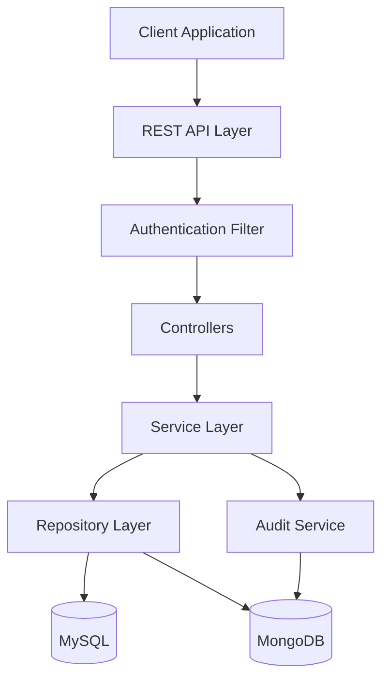

# Warehouse Management SaaS

A production-grade multi-tenant SaaS platform for warehouse and vendor management built with Java Spring Boot.

## 🚀 Features

### Core Functionality
- **Multi-tenant Architecture**: Complete data isolation between organizations
- **JWT Authentication**: Secure token-based authentication with 24-hour expiration
- **Role-Based Access Control (RBAC)**: 5 distinct roles with granular permissions
  - Super Admin (platform owner)
  - Company Admin (organization management)
  - Ops Manager (operations and inventory)
  - Warehouse Staff (inventory operations)
  - Vendor (view orders and shipments)

### Business Modules
- **Organization & User Management**: Company registration, user invitations, role assignment
- **Warehouse Management**: Multiple warehouses, storage zones, capacity tracking
- **Vendor Onboarding**: Vendor profiles, contracts, SLAs, performance ratings
- **Inventory Lifecycle**: Stock in/out, transfers, adjustments with reason codes
- **Purchase Order Workflow**: Draft → Approval → Shipment → Receipt
- **Shipment Tracking**: Mock carrier integration with status updates
- **Reporting & Alerts**: Low stock alerts, warehouse utilization, vendor KPIs
- **Audit Logging**: Complete audit trail in MongoDB

## 🛠️ Technology Stack

- **Framework**: Spring Boot 3.2.1
- **Language**: Java 17
- **Databases**: 
  - MySQL 8.0 (transactional data)
  - MongoDB 6.0 (audit logs)
- **Security**: Spring Security + JWT
- **API Documentation**: Swagger/OpenAPI 3.0
- **Build Tool**: Maven
- **Containerization**: Docker + Docker Compose
- **Testing**: JUnit 5 + Mockito

## 📋 Prerequisites

- Java 17 or higher
- Maven 3.6+
- Docker and Docker Compose (for containerized deployment)
- MySQL 8.0 (if running locally without Docker)
- MongoDB 6.0 (if running locally without Docker)

## 🏗️ Project Structure

```
warehouse-management/
├── src/
│   ├── main/
│   │   ├── java/com/warehouse/
│   │   │   ├── config/          # Security, OpenAPI configuration
│   │   │   ├── controller/      # REST controllers
│   │   │   ├── dto/             # Data Transfer Objects
│   │   │   ├── entity/          # JPA entities
│   │   │   ├── document/        # MongoDB documents
│   │   │   ├── repository/      # JPA & MongoDB repositories
│   │   │   ├── security/        # JWT, authentication
│   │   │   ├── service/         # Business logic
│   │   │   └── exception/       # Custom exceptions
│   │   └── resources/
│   │       ├── application.yml           # Main configuration
│   │       ├── application-dev.yml       # Development config
│   │       ├── application-prod.yml      # Production config
│   │       └── db/
│   │           ├── schema.sql            # Database schema
│   │           └── seed-data.sql         # Sample data
│   └── test/                    # Unit and integration tests
├── Dockerfile
├── docker-compose.yml
└── pom.xml
```

## 🚀 Quick Start

### Option 1: Docker Compose (Recommended)

1. **Clone the repository**
   ```bash
   cd "/Users/shivdev/Desktop/Spring/warehouse management"
   ```

2. **Start all services**
   ```bash
   docker-compose up -d
   ```

3. **Access the application**
   - API Base URL: `http://localhost:8080/api`
   - Swagger UI: `http://localhost:8080/api/swagger-ui.html`

### Option 2: Local Development

1. **Start MySQL**
   ```bash
   # Using Docker
   docker run -d --name warehouse-mysql \
     -e MYSQL_ROOT_PASSWORD=root_password \
     -e MYSQL_DATABASE=warehouse_db \
     -e MYSQL_USER=warehouse_user \
     -e MYSQL_PASSWORD=warehouse_pass \
     -p 3306:3306 mysql:8.0
   ```

2. **Start MongoDB**
   ```bash
   docker run -d --name warehouse-mongodb \
     -p 27017:27017 mongo:6.0
   ```

3. **Build and run the application**
   ```bash
   mvn clean install
   mvn spring-boot:run -Dspring-boot.run.profiles=dev
   ```

## 📚 API Documentation

Once the application is running, access the interactive API documentation at:

**Swagger UI**: `http://localhost:8080/api/swagger-ui.html`

### Sample API Endpoints

#### Authentication
- `POST /api/auth/register` - Register new organization
- `POST /api/auth/login` - User login

#### Users (Admin only)
- `POST /api/users` - Create user
- `GET /api/users` - List users
- `PUT /api/users/{id}` - Update user

#### Warehouses
- `POST /api/warehouses` - Create warehouse
- `GET /api/warehouses` - List warehouses
- `POST /api/warehouses/{id}/zones` - Add storage zone

#### Inventory
- `POST /api/inventory/stock-in` - Receive stock
- `POST /api/inventory/transfer` - Transfer stock
- `GET /api/inventory/alerts/low-stock` - Low stock alerts

#### Purchase Orders
- `POST /api/purchase-orders` - Create PO
- `PUT /api/purchase-orders/{id}/approve` - Approve PO
- `PUT /api/purchase-orders/{id}/receive` - Receive goods

## 🔐 Default Credentials

After running seed data:

| Role | Email | Password |
|------|-------|----------|
| Super Admin | admin@warehouse-saas.com | admin123 |
| Company Admin | admin@democorp.com | admin123 |
| Ops Manager | ops@democorp.com | manager123 |
| Warehouse Staff | staff@democorp.com | staff123 |

## 🧪 Testing

```bash
# Run all tests
mvn test

# Run with coverage
mvn clean test jacoco:report

# View coverage report
open target/site/jacoco/index.html
```

## 🐳 Docker Commands

```bash
# Build image
docker build -t warehouse-management .

# Start services
docker-compose up -d

# View logs
docker-compose logs -f app

# Stop services
docker-compose down

# Stop and remove volumes
docker-compose down -v
```

## 📊 Database Schema

The application uses two databases:

### MySQL (Transactional Data)
- organizations
- users
- warehouses, storage_zones
- vendors, products
- inventory, inventory_transactions
- purchase_orders, purchase_order_items
- shipments

### MongoDB (Audit Logs)
- audit_logs collection

## 🔧 Configuration

### Environment Variables (Production)

```bash
# Database
DB_URL=jdbc:mysql://your-rds-endpoint:3306/warehouse_db
DB_USERNAME=your_db_user
DB_PASSWORD=your_db_password

# MongoDB
MONGODB_URI=mongodb://your-mongodb-uri/warehouse_audit

# JWT
JWT_SECRET=your-256-bit-secret-key-change-this
```

## 📈 Architecture



## 🚢 Deployment

### AWS Deployment

See [AWS_DEPLOYMENT.md](AWS_DEPLOYMENT.md) for detailed instructions on deploying to:
- EC2 instances
- RDS MySQL
- MongoDB Atlas
- Application Load Balancer

## 🤝 Contributing

1. Fork the repository
2. Create a feature branch (`git checkout -b feature/amazing-feature`)
3. Commit your changes (`git commit -m 'Add amazing feature'`)
4. Push to the branch (`git push origin feature/amazing-feature`)
5. Open a Pull Request

## 📝 License

This project is licensed under the Apache License 2.0 - see the LICENSE file for details.

## 📧 Support

For support, email support@warehouse-saas.com or open an issue in the repository.

## 🎯 Roadmap

- [ ] Email notifications for low stock and PO approvals
- [ ] Advanced reporting with charts and analytics
- [ ] Mobile app for warehouse staff
- [ ] Barcode/QR code scanning
- [ ] Integration with real carrier APIs
- [ ] Multi-warehouse transfer optimization
- [ ] AI-powered demand forecasting

---

**Built with ❤️ using Spring Boot**
